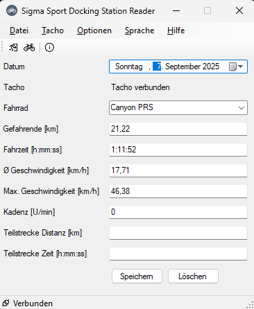
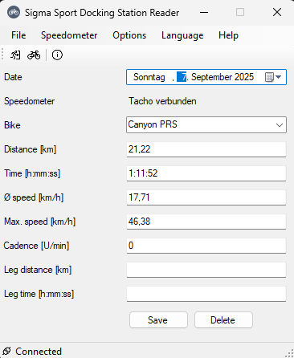

# SigmaNotificationApp
A small app to check if a Sigma speedometer is available in its docking station and to read its data.

## Prerequisites
- Windows 10/11 64bit
- Sigma Sport Docking Station TL2012
- Sigma Sport speedometer(*)
- BikeDB2025 to store the data (recommended, can be found on my Github account)

(*) currently BC12.12, BC16.12 and BC16.12 STS are supported

## Features
- Can be minimized and waits idle beneath the clock on a Windows system.
- Languages: German and English
- Help.html which can be browsed via the help menu. Available only in German, but with much more information about the features.
- Stores data in a JSON file, optimized to be imported into BikeDB2025, but could also be used for other applications.

## Screenshots

The DateTimePicker is dependent on the Operating System used. On my Windows 11 it will always show the German date. If you've got an English OS, that output may vary.

## Console app
In the directory ConsoleApp you can also find the basic C#-code to access the cradle aka Docking Station. 
This was used for debugging and learn the protocol of the speedometer. 
It might be useful for anyone trying to program their own application.

## Credits
The original work was done by Alfonso Martone. Check out his original work at:
https://gitlab.com/ciofeca/sdsdata

## License
Because Alfonso used it, I publish my work also under the MIT License. Feel free to do what you want.

# Copyright
Besides the license, this application is the original work of Dipl.-Biol. Björn Zedroßer, Cologne, Germany.
(c) 2025